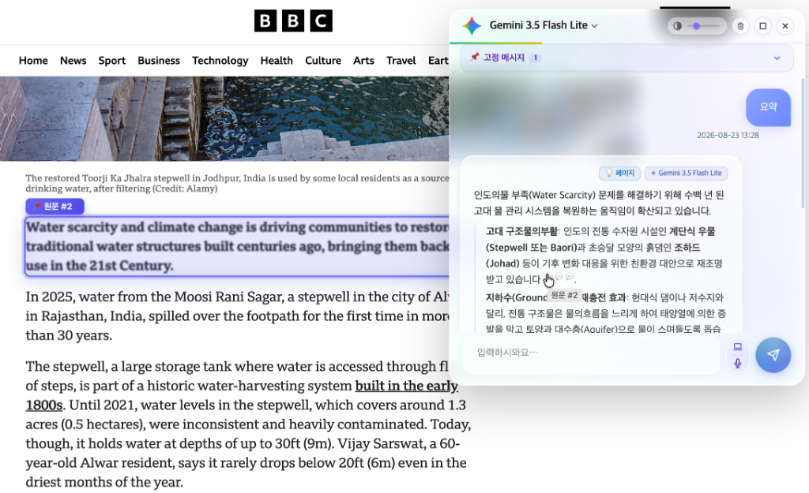
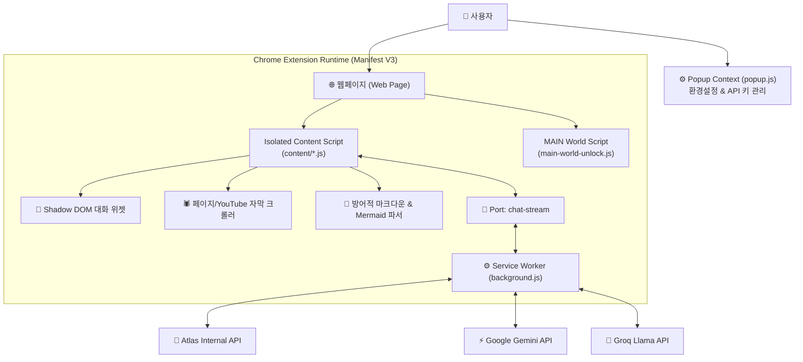

# 🤖 WithAvis

<div align="center">



### **웹 서핑의 패러다임을 바꾸는 가장 똑똑한 브라우저 AI 비서**

보고 있는 웹페이지, 길고 긴 보고서(PDF), YouTube 동영상 자막까지  
단 하나의 단축키(`Alt+Q`)로 실시간 요약·분석·시각화·음성 대화를 경험해보세요.

[](https://developer.chrome.com/docs/extensions/mv3/intro/)
[](#-기술-아키텍처-architecture)
[](#1-🤖-서버리스-멀티-ai-엔진)
[](#-개인정보-보호--zero-trust-보안)
[](https://github.com/leejhn/chrExtChatBot.github.io)

</div>

---

## ⚡ 왜 **WithAvis**를 써야 할까요? (Why WithAvis?)

| ❌ 기존의 불편한 방식 | ✨ **WithAvis**와 함께하는 스마트한 방식 |
| :--- | :--- |
| 웹페이지 텍스트를 일일이 긁어서 ChatGPT 탭에 붙여넣기 | **웹페이지 접속 상태 그대로 `Alt+Q`로 즉시 요약 & 질의응답** |
| 30분짜리 YouTube 영상을 처음부터 끝까지 다 돌려보기 | **영상 자막(Transcript)을 자동 수집하여 핵심만 3초 요약** |
| 복잡한 텍스트 답변을 읽느라 한눈에 파악하기 어려움 | **AI 답변을 실시간 Mermaid 차트/다이어그램으로 자동 시각화** |
| 복사 금지/우클릭 방지 때문에 텍스트 수집이 막힘 | **원클릭 우클릭/드래그 금지 해제로 제약 없는 텍스트 활용** |
| 내 개인정보나 API 키가 외부 중계 서버에 남을까 불안함 | **중계 서버 0%! 브라우저 로컬(`chrome.storage`)에만 안전 저장** |

---

## 🌟 핵심 주요 기능 (Key Features)

### 1. 🤖 서버리스 멀티 AI 엔진 (Multi-AI Engine)
중계 서버 없는 **100% Direct Streaming** 구조로 최소 지연 시간(Low Latency)을 제공합니다.
* **Google Gemini**: 다양한 Gemini 모델 라인업 지원
* **Groq Llama**: Llama 3 기반 초고속 LLM 인퍼런스 엔진 지원
* **Atlas Enterprise Platform**: 사내망 전용 Atlas AI 엔드포인트 완벽 연동

### 2. 🧠 지능형 웹 컨텐츠 & 문서 분석 (`crawler.js`)
* **스마트 웹 크롤링**: 노이즈 태그(광고, 스크립트)를 정제하고 핵심 본문(최대 15,000자)을 AI에 전송
* **YouTube 자막 추출**: 유튜브 접속 시 영상 자막을 자동 수집하여 동영상 내용 기반 Q&A 지원
* **멀티모달 이미지 & PDF 분석**: Drag & Drop 또는 붙여넣기로 문서/이미지를 AI에게 직접 전달

### 3. 📊 내장 Mermaid 다이어그램 자동 시각화 (`mermaid-manager.js`)
* **자동 시각화 파이프라인**: AI 답변을 순서도(Flowchart), 시퀀스 다이어그램, 파이차트 등 시각적 차트로 자동 변환
* **방어적 해독 (Defensive Parsing)**: 백틱 구문이 깨져도 시각화 코드를 자동 구출하여 렌더링
* **인라인 줌/팬 & PNG 저장**: 차트를 클릭해 대형 모달에서 확대/축소하고 고해상도 PNG로 다운로드

### 4. 🎙️ 음성 인식(STT) & 자연스러운 낭독(TTS) (`voice-manager.js`)
* **STT 음성 질문**: `Alt+V` 한 번으로 키보드 없이 마이크를 통해 질문
* **TTS 음성 답변**: AI가 생성한 답변을 한국어/영어 음성으로 자연스럽게 낭독

### 5. 📌 핀(Pin) 카드 고정 & 자유로운 UI 리사이징 (`pinned-manager.js`)
* **중요 답변 고정**: 요약이나 코드를 위젯 상단에 핀(Pin)으로 올려둔 채 작업 지속
* **마우스 드래그 조절**: 핀 카드와 위젯의 크기를 마우스로 자유롭게 조절

### 6. 🔓 우클릭 & 복사 제한 무력화 (`right-click-unlock.js`)
* 복사 금지, 드래그 방지, 우클릭 제한이 적용된 웹사이트의 제약을 클릭 한 번으로 해제

---

## 🛠️ 사용 방법 (User Guide)

### ⌨️ 편리한 단축키 & 인터랙션
| 조작 방식 | 단축키 / 동작 | 설명 |
| :--- | :--- | :--- |
| **위젯 토글** | `Alt + Q` *(Mac: `Option + Q`)* | 챗봇 위젯 열기 / 닫기 |
| **음성 질문** | `Alt + V` *(Mac: `Option + V`)* | 마이크 음성 인식(STT) 시작 |
| **우클릭 메뉴** | 텍스트/이미지 선택 ➔ 우클릭 | 선택 영역을 AI 질문으로 즉시 전달 |
| **플로팅 버튼** | 화면 우측 하단 런처 클릭 | 챗봇 위젯 열기 |

### ⚙️ 팝업 환경설정 (브라우저 상단 확장 프로그램 아이콘)
* **AI 제공자 선택**: Gemini, Groq, Atlas 중 원하는 LLM 선택
* **API 키 관리**: 사용자의 개인 API Key 안전하게 입력 및 저장
* **기능 토글**: 우클릭 제한 해제, 도메인별 대화 이력 유지 등 온/오프 설정

---

## 🏗️ 기술 아키텍처 (Architecture)



---

## 🛡️ 개인정보 보호 & Zero-Trust 보안

1. **Local-Only Storage**: 사용자의 API 인증 키와 대화 내역은 외부 서버로 전송되지 않으며, 사용자의 브라우저 내 암호화 저장소(`chrome.storage.local`)에만 보관됩니다.
2. **휘발성 수집**: 크롤링된 페이지 컨텍스트 데이터는 AI 답변 생성 직후 메모리에서 즉시 소멸하며 어떠한 외부 DB에도 저장되지 않습니다.

---

## 📂 주요 시스템 구성 (Extension Structure)

```text
WithAvis Extension/
├── manifest.json                   # Extension V3 Manifest 정의
├── background.js                   # Service Worker & Stream Router
├── popup.html / popup.js           # 환경설정 팝업 UI & 로직
└── content/                        # Content Scripts 모듈
    ├── main.js                     # 엔트리 포인트
    ├── controller.js               # 위젯 라이프사이클 오케스트레이터
    ├── markdown.js                 # 방어적 마크다운 파서
    ├── mermaid-manager.js          # Mermaid 시각화 & Zoom/PNG 모달
    └── crawler.js                  # DOM 텍스트 정제 & YouTube 자막 수집
```
